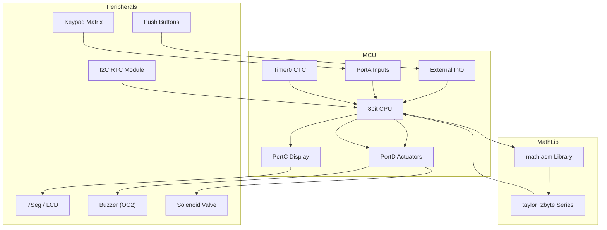

# Custom Alarm / Timer / Sprinkler System on ATmega128



---

## Project Overview

This project is a handwritten AVR Assembly implementation of:

* **Alarm clock** with multiple schedules
* **Countdown timer** with millisecond precision
* **Sprinkler control** via solenoid valve

Designed on the ATmega128 to:

* Master **register-level** programming
* Build a **reliable**, **low-latency** embedded system
* Utilize **fixed-point math** and **bitwise macros** for performance

---

## Architecture & Timing Math

1. **Timer0 Configuration** (CTC mode): generates a 1 ms tick

   * **Formula:** OCR0 = F\_CPU / (prescaler × f\_tick) − 1
   * With F\_CPU=16 MHz, prescaler=64, f\_tick=1 kHz ⇒ OCR0=16e6/(64×1e3)−1=249 ⇒ 250 loaded
2. **Software Clock**: accumulates `ms_count` → seconds/minutes
3. **Event Scheduler**: compares current time to alarm table in EEPROM
4. **Sprinkler Duty Cycle**: uses integer math to compute on/off intervals (e.g. 5 min ON, 55 min OFF)
5. **Display Multiplexing**: BCD conversion and bit-shifting for 7‑segment scanning
6. **Debounce Logic**: constant-time loop (\~20 ms) to reject spurious presses

---

## Key Features & Code Explanation

### Timer0 Initialization with Math

**Code** (`timer0.asm:init_timer`):

```asm
    ; CTC @1ms: OCR0 = 16e6/(64*1e3)-1 = 249
    ldi   r16, (1<<WGM01)
    out   TCCR0, r16          ; CTC mode
    ldi   r16, (1<<CS01)|(1<<CS00)
    out   TCCR0, r16          ; clk/64 prescale
    ldi   r16, 249
    out   OCR0, r16           ; compare match at 250 cycles
    ldi   r16, (1<<OCIE0)
    out   TIMSK, r16          ; enable CTC interrupt
    sei                      ; global interrupt enable
```

**Explanation:**

* Sets Timer0 to **Clear Timer on Compare (CTC)**.
* Prescaler divides 16 MHz by 64 → 250 kHz timer clock.
* Compare match every 250 ticks → 1 ms period.
* Interrupts drive timebase with zero drift.

---

### Timer0 ISR: Fixed-Point Rollovers

**Code** (`timer0.asm:ISR_TIMER0`):

```asm
ISR_TIMER0:
    push  r24
    in    r24, SREG
    push  r24
    ; increment ms_count, roll into seconds
    lds   r20, ms_count
    subi  r20, -1          ; r20++
    cpi   r20, 1000
    brlo  .no_sec
    ldi   r20, 0
    rcall tick_second       ; handle sec/min rollover
.no_sec:
    sts   ms_count, r20
    pop   r24
    out   SREG, r24
    pop   r24
    reti
```

**Explanation:**

* Uses `subi r20, -1` for single-cycle increment.
* Compares against **1000** to roll ms → sec.
* Calls `tick_second` to update seconds/minutes counters.
* Ensures **SREG** and registers are restored to avoid context corruption.

---

### External Interrupt & Debounce

**Code** (`int0.asm:ISR_INT0`):

```asm
ISR_INT0:
    rcall debounce        ; ~20ms loop, fixed duration
    lds   r18, flags
    eor   r18, (1<<RUNNING)
    sts   flags, r18      ; toggle RUNNING bit
    reti
```

**Explanation:**

* `debounce` is a **fixed-delay macro** that loops for \~20 ms (calibrated using NOPs).
* Toggles a **RUNNING** flag in RAM to start/pause timebase or sprinkler.

---

### Display Multiplexing & BCD Logic

**Code** (`display.asm:update_display`):

```asm
update_display:
    lds   r21, disp_buffer ; BCD-coded digits
    ; send upper nibble to port, lower nibble next
    out   PORTC, r21
    rcall latch_digits
    rcall delay_1ms        ; refresh period ~1ms
    ret
```

**Explanation:**

* `disp_buffer` holds four BCD digits: HH\:MM or Timer value.
* Nibbles are masked/shfted for each 7‑segment driver.
* **Refresh rate** > 50 Hz per digit to avoid flicker.

---

### Sprinkler Control Logic

**Code** (`sprinkler.asm:control_valve`):

```asm
    lds   r22, run_mode
    cpi   r22, MODE_AUTO
    brne  .man_override
    ; compute cycle: N_on/(N_on+N_off)
    lds   r23, sec_count
    lds   r24, on_interval ; seconds on
    lds   r25, off_interval; seconds off
    add   r24, r25         ; total cycle
    mov   r26, r23
    subi  r26, r25         ; time since on start
    k_test:
      cpi   r26, r24
      brlt  .open_valve
      rjmp  .close_valve
    open_valve:
      sbi   PORTD, VALVE_PIN
      rjmp  .end
    close_valve:
      cbi   PORTD, VALVE_PIN
    end:
```

**Explanation:**

* Uses simple **integer subtraction** and **compare** to implement a modulo-like cycle without hardware modulo.
* **`on_interval`** and **`off_interval`** stored in EEPROM allow runtime config.

---

## Directory Structure

```
microcontrolleur-main/
├── src/
│   ├── main.asm
│   ├── timer0.asm
│   ├── int0.asm
│   ├── display.asm
│   ├── sprinkler.asm
│   └── utils.inc    ; macros & constants
├── Makefile         ; AVR-GCC for .asm sources
├── circuit_schematic.png
└── README.md
```

---

## Advanced Math & Taylor Libraries

Beyond timer and I/O control, two hand‑crafted libraries elevate the system’s computational capability:

### math.asm

A suite of fixed‑point arithmetic routines (`ap_fixed`‑style) that includes:

* **16×16→32 multiply** using `MUL`/`MULS`/`MULSU`, with overflow checks.
* **Integer divide** via restoring division (`div16_16`) for time interval scaling.
* **Power function** (`pow16`) that raises integers to small exponents with looped multiplication and shift normalization.

#### Example multiply routine snippet:

```asm
; r24:r23 ← r22 × r21
mul r23, r21      ; low byte result in r0:r1
mov r23, r0
mov r24, r1
clr r1            ; clear HI for signed operations
```

### taylor\_2byte.asm

Implements an **iterative 2-byte Taylor series** to approximate the Arrhenius equation

$k = e^{rac{-Ea}{RT}}$

* **Pre‑scaling**: the temperature input is scaled by 8-bit shifts to fit 16‑bit range.
* **Series expansion**: computes 1 + x + x²/2 + x³/6 up to three terms, where x = $-Ea/(R·T)$.
* **Nested subroutines**: uses `exp_cal` for series, `mul16` and `div16` from `math.asm`, and register push/pop for state preservation.

#### Taylor expansion driver:

```asm
exp_cal:
    push r18–r23        ; save temps
    lds  r18, x_low     ; x LSB
    lds  r19, x_high    ; x MSB
    ; term0 = 1
    ldi  r20, 1
    ; term1 = x
    mov  r21, r18
    mov  r22, r19
    ; term2 = x*x/2
    rcall mul16
    ldi  r23, 2
    rcall div16
    ; term3 = x*x*x/6
    rcall mul16
    ldi  r23, 6
    rcall div16
    ; sum terms
    add  r20, r21
    adc  r20, r22
    add  r20, r0
    adc  r20, r1
    add  r20, r2
    adc  r20, r3
    sts  arr_coeff, r20
    pop  r18–r23
    ret
```

*This library enables dynamic sprinkler‑duration computation based on real‑time temperature, fully in assembly.*

---

## Building & Flashing

```bash
make all
avrdude -p m128 -c usbasp -U flash:w:main.hex
```

---
